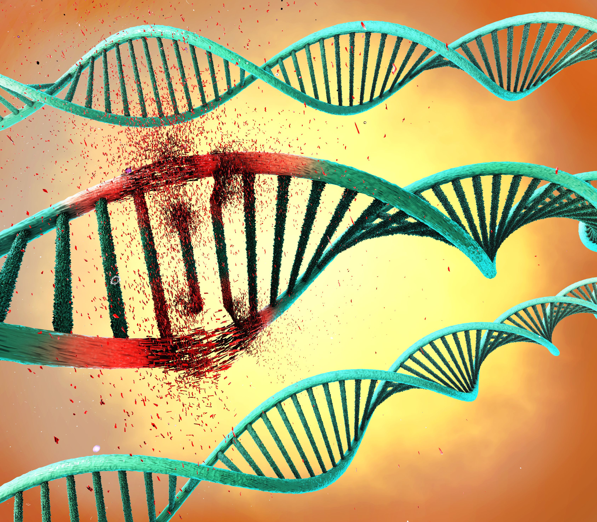

  
  <h2 style="margin-top: 20px; color: #333;">Tanmay Kadam</h2>
  

    Dive into insightful explorations on this case study which is focused on transforming cancer diagnosis using literature and Genomic data. A machine learning odyssey on Medium. Discover tutorials, thought pieces, and more to fuel your curiosity and enhance your knowledge. 
    
    The problem we are solving is NOT detecting cancer or not, there are multiple case study and articles you can find it. We are trying to solve, to distinguish two types of genetic mutations, one that leads to growth of tumour i.e. critical genetic mutation and other which is not. Explaining in cinematic way, Imagine you are Sherlock Holmes on a crime scene looking at clue(mutation), there are some clue(driver mutation) that will help to solve the crime case, while there are clue( passenger mutation) that don't contribute for it.

Figuring out which clue(mutation) are important is reading a bunch of pile of literature and reaching a destination. SO we are just going to ease on there effort and time by automating the process of classifying important features(mutations) and making this diagnosis more easy and subtle.
  

  <a href="https://medium.com/@tanmay.kdm" style="display: inline-block; margin-top: 20px; background-color: #1a8917; color: white; padding: 10px 20px; text-decoration: none; border-radius: 5px; font-weight: bold; box-shadow: 0 2px 4px rgba(0,0,0,0.2);">
    Read More
  </a>

